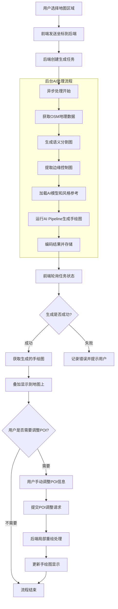

# AI生成导览手绘图

基于AI技术的地图手绘风格转换工具，将真实地理数据转换为艺术化的手绘导览图。

## 功能特点

- 🗺️ 支持任意区域地图选择
- 🎨 AI驱动的手绘风格转换
- 📍 基于真实OSM地理数据
- 🖼️ 实时预览和透明度调节
- 🌍 使用天地图瓦片服务

## 核心生成流程

1. **前端选区** → 用户在地图上选择区域，获取经纬度坐标
2. 生成卫星图 → 后端根据经纬度坐标,使用最大缩放,请求拼接瓦片裁剪,生成框选范围的高清卫星图
3. **OSM数据获取** → 后端通过Overpass API查询该区域的地理数据（建筑、道路、水体、绿地等）
4. **语义地图生成** → 将OSM数据转换为彩色语义图（绿色=公园，红色=水体，橙色=建筑/道路）
5. **Canny边缘检测** → 对语义图进行灰度转换，提取边缘轮廓作为结构控制图
6. **ControlNet结构控制** → 使用Canny轮廓图严格控制生成内容的空间布局和结构
7. **Stable Diffusion生成** → 根据优化后的提示词（强调忠实原始数据）+ ControlNet约束 + 可选的IP-Adapter风格迁移，生成手绘风格地图
8. POI调整优化 → 前端界面标识关键POI信息和类型,提交后端模型重新局部重绘
9. **结果返回** → 将生成的手绘图叠加到原地图区域

### 核心流程图



### 关键优化点

- ControlNet确保结构准确性（controlnet_conditioning_scale=1.2）
- 负面提示词防止"无中生有"
- 降低guidance_scale减少过度生成

这样既保证了地理准确性，又实现了艺术化的手绘效果。

## 技术栈

- **前端**: HTML5 + Leaflet.js + 天地图API
- **后端**: FastAPI + Python
- **AI模型**: Stable Diffusion + ControlNet + IP-Adapter
- **数据源**: OpenStreetMap (OSM) + Overpass API
- **GPU加速**: CUDA + xFormers优化

## 快速开始

### 环境要求

- Python 3.8+
- CUDA支持的GPU（推荐）
- 8GB+ GPU显存

### 安装依赖

```bash
pip install -r requirements.txt
```

### 运行服务

```bash
# GPU版本（推荐）
python main_gpu.py

# 或使用批处理文件
start_gpu.bat
```

### 访问应用

打开浏览器访问：http://127.0.0.1:8003

## 使用说明

1. 点击"选择区域"按钮
2. 在地图上拖拽选择要生成手绘图的区域
3. 点击"生成手绘地图"开始AI处理
4. 等待生成完成，可调节透明度查看效果

## 配置说明

### 天地图API密钥

需要在 `index.html` 中替换 `YOUR_API_KEY` 为您的天地图API密钥：

```javascript
// 在天地图官网申请免费API密钥
const apiKey = "YOUR_API_KEY";
```

### GPU优化设置

程序会自动检测GPU并启用以下优化：

- Float16精度推理
- 注意力切片优化
- xFormers内存高效注意力
- VAE切片和平铺优化

## 项目结构

```
AI-TourMap-Generator/
├── index.html          # 前端界面
├── main_gpu.py         # GPU优化版后端服务
├── start_gpu.bat       # Windows启动脚本
├── requirements.txt    # Python依赖
├── model_cache/        # AI模型缓存目录
├── debug_runs/         # 调试输出目录
└── generation_gpu.log  # 运行日志
```

## 许可证

MIT License
