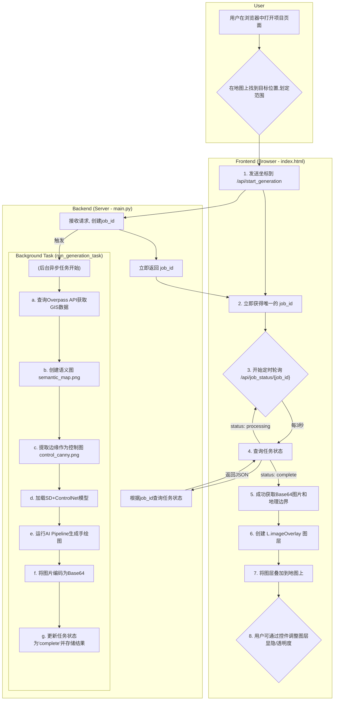

### **项目实现规划：AI手绘地图生成器 (分阶段实施)**

---

### **整体工作流程图 (Mermaid)**

---

### **第一阶段：基础底图生成 (当前目标)**

本阶段的核心目标是实现从用户划定地理范围到生成高质量、手绘风格的基础地图背景（底图）的完整流程。此阶段不包含具体的POI（兴趣点）信息。

#### **步骤1：前端用户界面 (已完成部分)**

* **功能**: 提供一个带有卫星和标准地图切换的界面，并允许用户使用绘图工具（多边形/矩形）划定一个地理范围。
* **现状**: 已在 `index.html` 中实现。

#### **步骤2：后端服务搭建**

* **技术**: Python + FastAPI/Flask。
* **目标**: 创建一个后端服务，能够接收前端发送过来的地理范围坐标。

#### **步骤3：GIS数据获取与处理**

* [ ] **目标**: 根据接收到的范围，从OpenStreetMap (OSM) 获取生成底图所需的基础地理要素。
* [ ] **查询内容**:
  * [ ] **线状要素**: 道路 (`highway=*`), 路径 (`highway=path`), 水系 (`waterway=*`), 围墙/栅栏 (`barrier=*`)。
  * [ ] **面状要素**: 水体 (`natural=water`), 绿地/森林 (`landuse=forest`, `leisure=park`), 建筑轮廓 (`building=yes`)。
* [ ] **工具**: Overpass API。

#### **步骤4：核心AI生成**

* [ ] **目标**: 将获取的GIS数据转换成AI能理解的“控制图”，并调用AI模型生成手绘风格图像。

**实现**:

1. [ ] **创建语义分割图**: 将上一步获取的道路、水体、绿地等要素，用不同纯色绘制在一张空白画布上，形成AI生成时的“骨架”。
2. [ ] **调用AI模型**: 使用Stable Diffusion + ControlNet，以语义分割图作为精确控制条件，结合描述风格的Prompt文本，生成手绘底图。
3. [ ] **返回图像**: 将生成的图片返回给前端显示。

待解决:

[ ] 生成的手绘图,可以参考提供的参考手绘地图风格,这样确保风格一致.

[ ] 生成的手绘地图后续需要切成瓦片,这样就要求有高分辨率. 但是stable diffusion无法直接处理高分辨率的图片,需要使用其他方式,比如切分后处理再合并.

---

### **第二阶段：POI信息集成 (后续规划)**

本阶段将在已有的底图生成能力之上，增加POI的自动提取、人工管理和最终叠加功能。

* **目标**: 实现POI的完整处理流程。自动增加部分poi信息后,界面允许手动增加poi,并且增加poi的相关照片/图片作为后续生成该点位的素材.
* **规划中的功能**:
  1. **POI自动提取**: 从OSM、商业地图API等数据源自动抓取POI信息。
  2. **数据融合**: 将多来源的POI数据进行整合与去重。
  3. **POI手动管理**: 在前端提供界面，允许用户在地图上对POI点进行拖拽修改、编辑、删除和新增。
  4. **最终叠加**: 在AI生成好的手绘底图上，根据用户最终确认的POI位置和信息，绘制图标和文字。

todo:

- [X] 界面透明调整的组件无法拖动,可以点击.
- [ ] 目前是使用地图框选后处理的图片由controlNet处理,我想增加风格参考图片,如何实现
- [ ] 图片大小需要调整,选中范围后,需要截取最大缩放级别的对应范围的地图截图.
- [ ] 上一步的图片,范围太大,如何让sd处理
